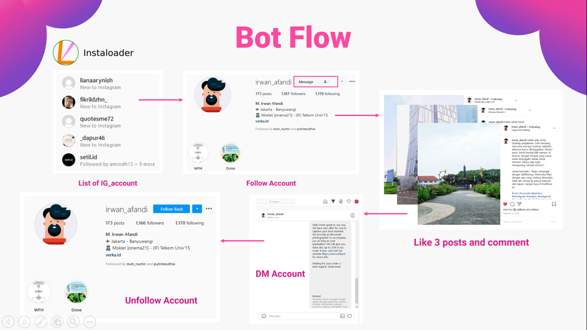

# Instagram Bot
This porject uses two libraries, that is:
- Instaloader, this library can be used for scrape many data from instagram like list of followers account, list of account we followed, donwload (post, instastory, ig_video, etc), get post comments and others.
- Selenium, this library is used to create an automatic process on Instagram like click a button, give comments, direct message, go to url link and others.
<br><b>Note:</b> Don't forget to [install](https://github.com/irwanafandi24/Instagram-Bot-and-Web-Scraper) Instaloader and Selenium

**Project overview**
<p align="center"></p>

### How this Instagram Bot works?
<b><i>Instaloader</b></i>
<br>Start login to our instagram account.
```sh
insta = login_instaloader('username','password')
```
Get the account info (list of followers, followed, doesn't follback and fans) in dataframe format.
```sh
followers, follows, not_follback, fans = get_followers_following(insta, 'ig_account')
```
Show all data inside the dataframe.
```sh
pd.set_option('display.max_rows', not_follback.shape[0]+1)
n_follback = not_follback.reset_index()
n_follback.drop('index', axis=1, inplace =True)
print(n_follback)
```
Convert dataframe (column) to list.
```sh
fans_array = fans.account.tolist()
```
<p align="justify">We will use this instagram accounts list in the next steps like we want to follow all accounts who follow "irwan_afandi". Another example is that we will use the accounts list who didn't follow us back to start unfollow them. So in the <b><i>next step we need list of accounts</b></i>, you can <i>determine that accounts by yourself or use instaloader.</i><br></p>

<b><i>Selenium and Web-Driver</b></i>
<br>Start login to our instagram account via browser automatically.
```sh
insta_bot = InstagramBot("username","password")
insta_bot.login()
```
Start to follow some accounts, like their first three posts and leave a single comment.
```sh
comments = ["Wow, I like your pict broh! Follback please :)", 
           "What a beautiful it was, we have some hobbies dude.",
           "Excellent pict! don't forget to see my gallery.",
           "Nice to meet you dude, may I get a follback :D"]
accounts = ["tanboy_kun", "__mllmllm18__", "resepcemilan.unik", "charvihijab"]           
insta_bot.start_follow(accounts,comments)
```
Like first three posts and leaving a single comment (without following that account).
```sh
comments = ["Wow, I like your pict broh! Follback please :)", 
           "What a beautiful it was, we have some hobbies dude.",
           "Excellent pict! don't forget to see my gallery.",
           "Nice to meet you dude, may I get a follback :D"]
accounts = ["tanboy_kun", "__mllmllm18__", "resepcemilan.unik", "charvihijab"]     
insta_bot.like_comment(accounts, comments[random.randint(0,3)], 0)
```
Direct Message to some accounts.
```sh
list_dm = ['irwan_afandi', 'miralem_pjanic']
message = "Hello guys, do you want to visit my gallery. Start to share our knowledge together."
insta_bot.start_dm(list_dm, message)
```
Unfollow some accounts.
```sh
list_unfollow = ['sidomulyo_stable', 'pusatmikasurabaya']
insta_bot.start_unfollow(list_unfollow)
```
#

<p align="justify">Maybe when you run this program there will be some errors because some structure of the Instagram website has changed, so you have to handle it by yourself. This is the recomendation videos to learn about selenium, you can access in this link <a href="https://www.youtube.com/watch?v=BGU2X5lrz9M&t=1349s">selenium1</a> and <a href="https://www.youtube.com/watch?v=wCoTJdhRcQE&ab_channel=TechnologyforNoobs">selenium2</a>. Last but not least, <b><i>this code is only used for learning</i></b>. So if there is some problems with your instagram account after you try this Bot (suspend, indicate bot or permanently deleted by Facebook. Inc), it's not my fault.</p>

🎉 <b>Congrats!</b> are you ready to develop your instagram business account? 🎉
